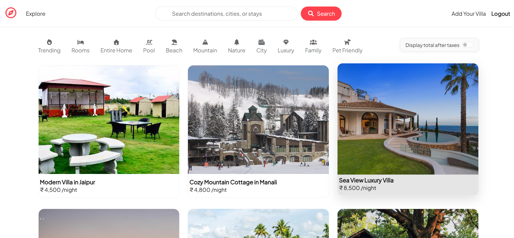
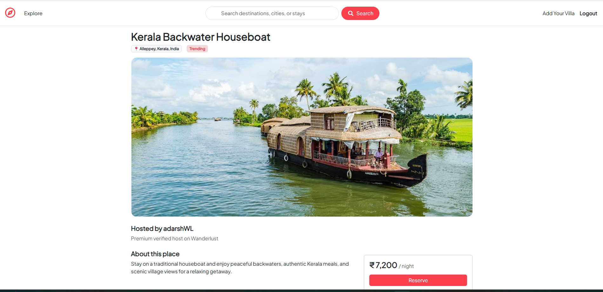
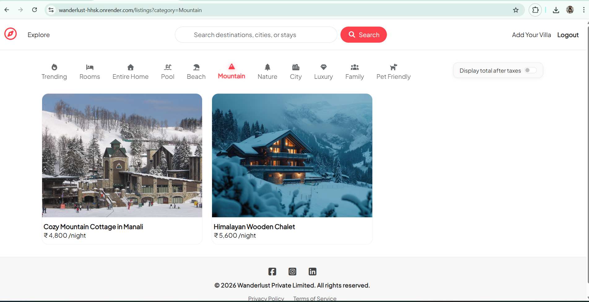
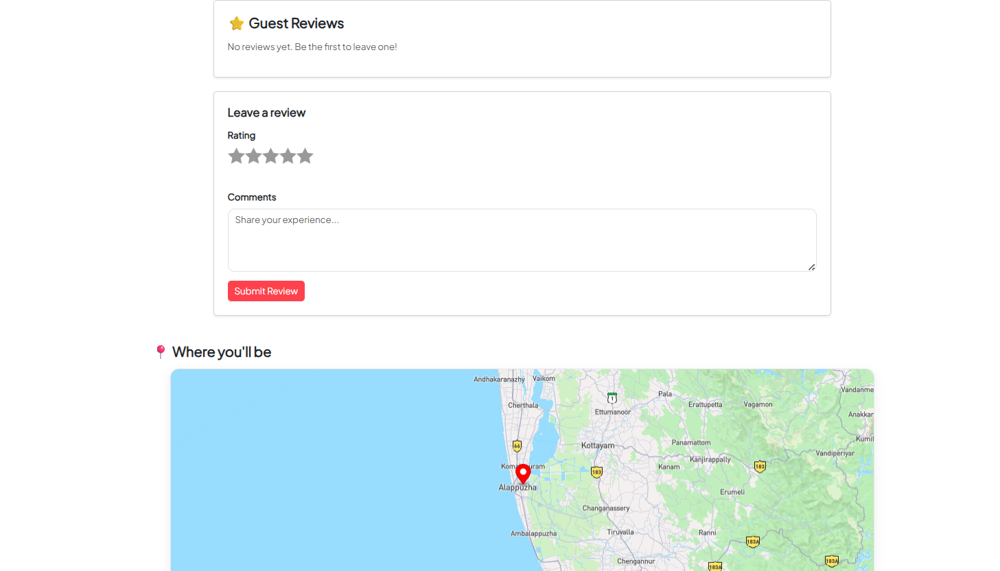
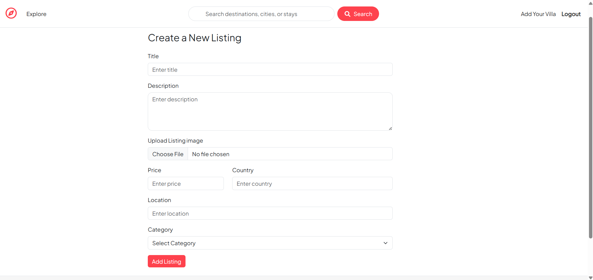
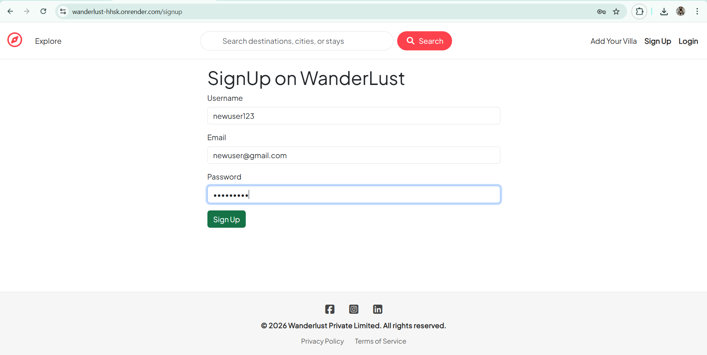

# 🌍 Wanderlust — Vacation Rental Platform

Wanderlust is a full-stack vacation rental web application inspired by Airbnb. It allows users to explore, list, and book unique stays such as villas, cottages, houseboats, and luxury properties. Built with the **MVC (Model-View-Controller)** architecture, it ensures a clean separation of concerns and production-grade scalability.

---

## 🚀 Features

* **Browse & Filter:** Explore rentals across categories like Beach, Mountain, Luxury, City, and Nature.
* **Search:** Find listings by destination or stay type.
* **Interactive Maps:** Real-time location tagging using **Mapbox API**.
* **Image Management:** Cloud-based image uploads via **Cloudinary**.
* **User Authentication:** Secure Signup/Login system with **Passport.js**.
* **Full CRUD:** Authenticated users can Create, Read, Update, and Delete their own listings.
* **Dynamic Pricing:** Real-time price display with tax toggle features.
* **Responsive Design:** Fully optimized for desktop and mobile devices.

---

## 🛠️ Tech Stack

### **Backend**
* **Node.js & Express.js:** Server-side logic and API routing.
* **MongoDB & Mongoose:** NoSQL database for flexible data modeling.
* **Passport.js:** Authentication middleware.

### **Frontend**
* **EJS (Embedded JavaScript):** Server-side templating for dynamic content.
* **Bootstrap 5:** For a modern, responsive UI.
* **Custom CSS:** Fine-tuned styling for a premium look.

### **Cloud Services**
* **Cloudinary:** Image hosting and transformation.
* **Mapbox:** Geospatial data and interactive maps.
* **Render:** Live deployment.

---

## 🧱 MVC Architecture

The project is structured to follow the **Model-View-Controller** design pattern for better maintainability:

* **Models:** `Listing`, `User`, and `Review` schemas using Mongoose.
* **Views:** EJS templates for the homepage, listing details, edit forms, and authentication.
* **Controllers:** Logic for handling requests, interacting with the database, and rendering views.
* **Routes:** Defined endpoints connecting the controllers to the frontend.

---

## 📸 Screenshots

| Home Page | Listing Details - 1 (Basic info) |
| :---: | :---: |
|  |  |

| Category Filter | Listing Details - 2 (Maps & Review) |
| :---: | :---: |
|  |  |

| Create Listing | Sign Up Page |
| :---: | :---: |
|  |  |

---

## 🔮 Future Enhancements
💳 **Payment Gateway**: Stripe/Razorpay integration for bookings.

❤️ **Wishlist**: Ability for users to save their favorite properties.

📊 **Admin Dashboard**: Tools for managing users and verifying listings.

---

## 👨‍💻 Author
* Adarsh Kumar Lal
* Software Engineer | Full-Stack Developer
* Connect with me on 
